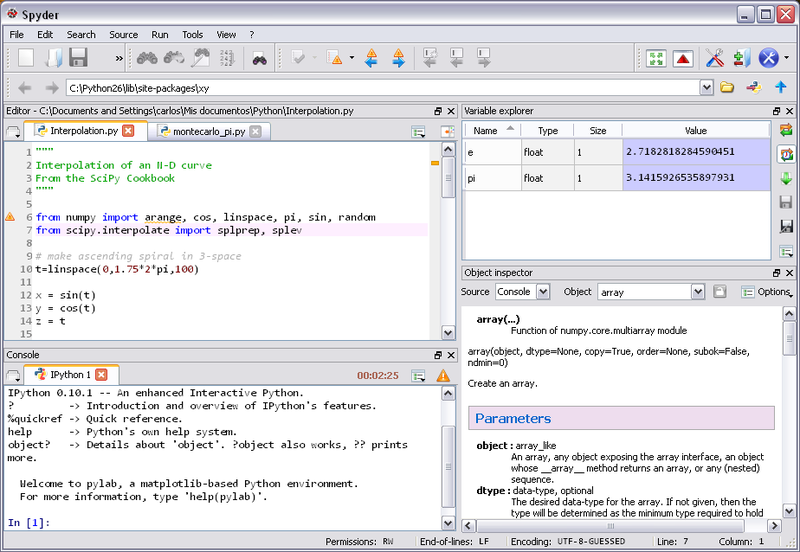
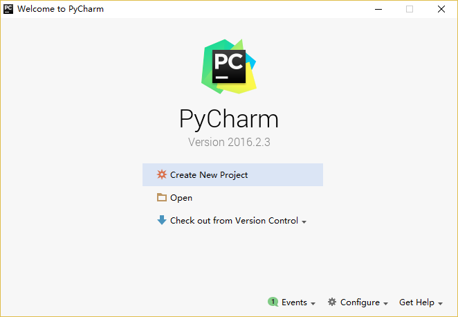
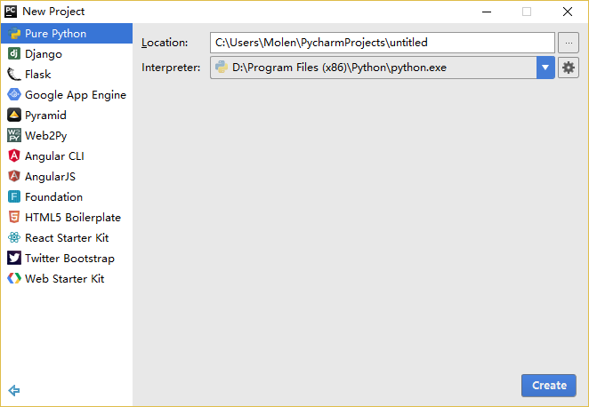
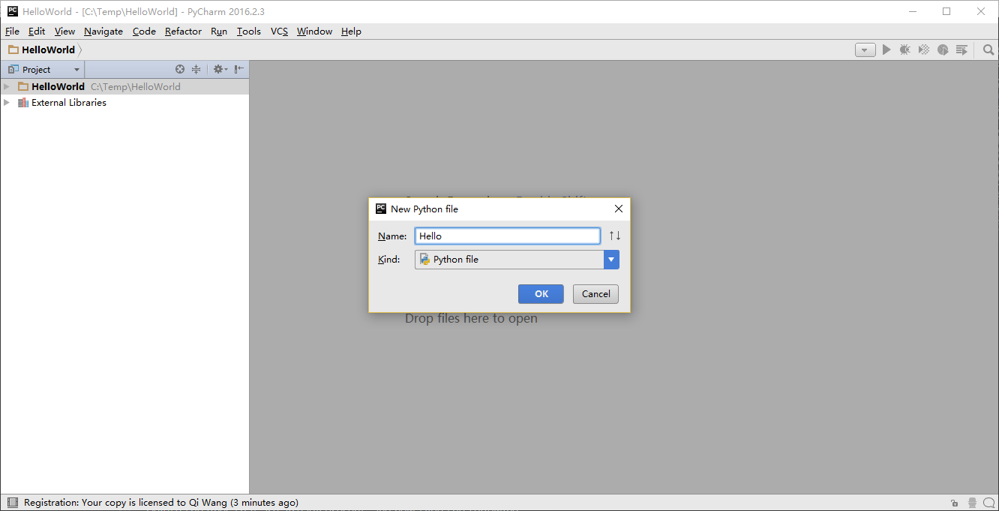
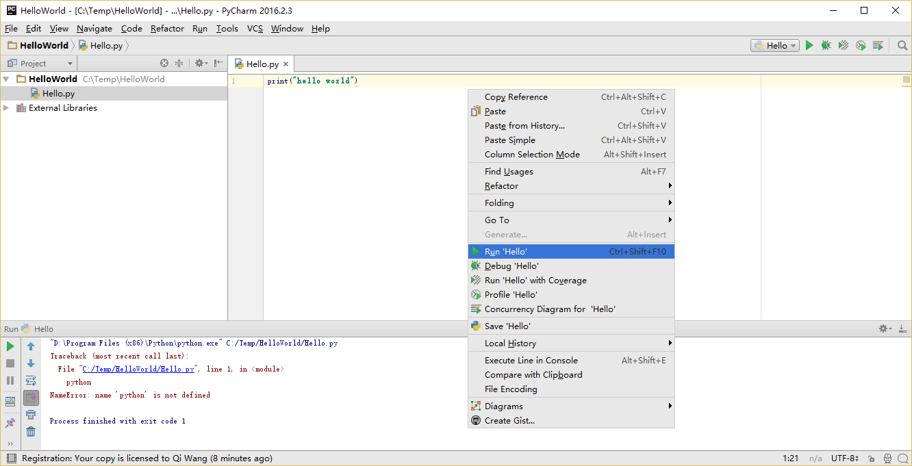
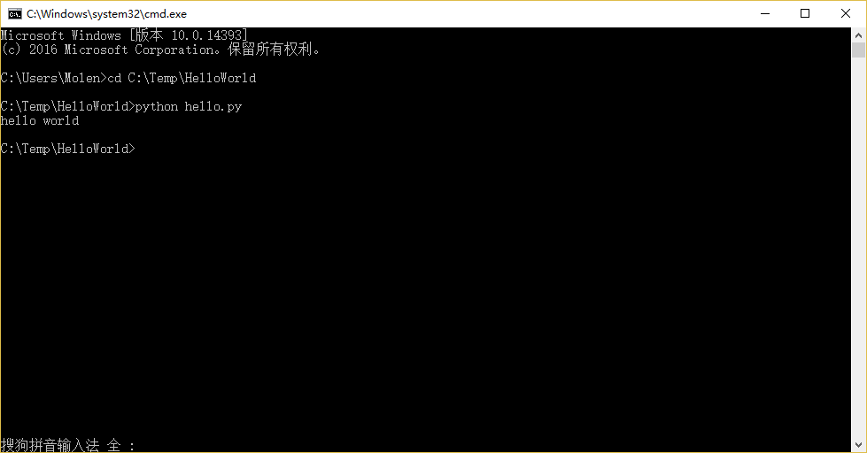

# 3 基础：初次运行

接下来我们通过尝试在 Python 中运行一个经典的“Hello World”程序，来了解如何编写、保存与运行 Python 程序。

python程序有两种运行方式——使用交互式解释器或使用源文件。下面我们将学习这两种方法。

## 终端（Terminal）

终端是一台机器和外界（人）进行交互（命令输入输出）的窗口。在图形化界面（Windows系统）出现之前，它是计算机唯一的交互方式。
虽然现在用户的大部分操作被软件中的窗口和按钮取代，但其背后的输入仍是通过具体的命令和接口来完成的。很多时候，终端仍然是更快捷高效的交互方式。

### Windows 操作系统
在Windows系统中启动终端可以通过`开始`，`运行`（快捷键为`Win`+ R），输入 cmd 并回车来实现。
然后在命令行中输入 `python3` 并按下回车键来打开 Python 提示符（Python Prompt）。
Windows用户只要正确地设置了PATH变量，应该可以从命令行启动解释器。
如果安装时没有将Python加到系统路径当中，则可以使用安装菜单中的 Anaconda Prompt 程序启动。

### Linux 或 MacOS系统

在你的操作系统中开启终端程序然后通过输入 `python3` 并按下回车键来打开 Python 提示符（Python Prompt）。


## 解释器环境

解释器启动之后，其中的输入就和平台无关了。

在 Python 启动后，你会看见在你能开始输入内容的地方出现了 `>>>` 。这个被称作 _Python 解释器提示符（Python Interpreter Prompt）_ 。

在提示符后输入：

```python
print("Hello World")
```

输入完成后按下回车键。你将会看到屏幕上打印出 `Hello World` 字样。

下面是一个在 Linux 电脑上你能够看见结果的示例。有关 Python 软件的细节将会因为你使用的电脑而有所不同，但是从提示符（如 `>>>` ）开始部分应该是相同的，而不会受到操作系统的影响。

```python
nightwing@halo:~$ python
Python 3.6.5 |Anaconda, Inc.| (default, Apr 29 2018, 16:14:56) 
[GCC 7.2.0] on linux
Type "help", "copyright", "credits" or "license" for more information.
>>> print("Hello World")
Hello World
>>>
```

你自然会注意到，Python 会立即给你输出了一行结果！你刚才所输入的便是一句独立的 Python _语句_ 。我们使用 `print` （不必太过惊讶）命令来打印你所提供的信息。在这里，我们提供了文本 `Hello World` ，然后它便被迅速地打印到了屏幕上。

退出解释器环境可以通过按下 `[ctrl + d]` 组合键或是输入 `exit()` （注意：要记住要包含括号 `()`）并敲下回车实现。

## 编辑器

要创建 Python 源代码文件，我们需要一款能够输入并保存代码的编辑器软件。一款优秀的面向程序员的编辑器能够帮助你的编写源代码文件工作变得轻松得多。故而选择一款编辑器确实至关重要。你要像挑选你想要购买的汽车一样挑选你的编辑器。一款优秀的编辑器能够帮助你更轻松地编写 Python 程序，使你的编程之旅更加舒适，并助你找到一条更加安全且快速的道路到达你的目的地（实现你的目标）。

对编辑器的一项最基本要求为 _语法高亮_ ，这一功能能够通过标以不同颜色来帮助你区分 Python 程序中的不同部分，从而能够让你更好 _看清_ 你的程序，并使它的运行模式更加形象化。

如果你对于从哪开始还没有概念，我推荐你使用[VSCode](https://code.visualstudio.com/) 或者 [PyCharm 教育版](https://www.jetbrains.com/pycharm-edu/) 软件，它们在 Windows、Mac OS X、GNU/Linux 上都可以运行。

如果你正在使用 Windows 系统，**千万不要用记事本**——这是一个很糟糕的选择，因为它没有语法加亮功能，不支持文本缩进功能。我们后面会了解它究竟有多重要。一款好的编辑器能够极大地提高工作效率。

如果你已是一名经验丰富的程序员，那你一定在用 [Vim](http://www.vim.org) 或 [Emacs](http://www.gnu.org/software/emacs/) 了。无需多言，它们都是最强大的编辑器之一，用它们来编写你的 Python 程序自是好处多多。

或许你有意去花费时间来学习 Vim 或 Emacs，那么我自是强烈推荐你学习它们二者中的一款，它们将在长远意义上对你裨益颇深。当然，正如我先前所推荐的，初学者可以以 PyCharm 开始，从而在此刻专注于学习 Python 而不是编辑器。

再次重申，请选择一款合适的编辑器——它能够让编写 Python 程序变得更加有趣且容易。

### Visual Studio Code（VSCode）
这是微软公司开发的一款跨平台开源编辑器，具有丰富的功能和扩展。官方网站为 [http://code.visualstudio.com/](https://code.visualstudio.com/)。
装好之后记得在扩展(Extension)中安装`中文语言包`和`python`支持。

### Vim

1. 安装 [Vim](http://www.vim.org)。
   * Mac OS X 应该通过 [HomeBrew](http://brew.sh/) 来安装 `macvim` 包。
   * Windows 用户应该通过 [Vim 官方网站](http://www.vim.org/download.php) 下载“自安装可执行文件”。
   * GNU/Linux  用户应该通过他们使用的发行版的软件仓库获取 Vim。例如 Debian 与 Ubuntu 用户可以安装 `vim` 包。
2. 安装 [jedi-vim](https://github.com/davidhalter/jedi-vim) 插件为 Vim 增添自动完成功能。
3. 安装与之相应的 `jedi` Python 包：`pip install -U jedi`

### Emacs

1. 安装 [Emacs 24+](http://www.gnu.org/software/emacs/)。
   * Mac OS X 用户应该从 [http://emacsformacosx.com](http://emacsformacosx.com) 获取 Emacs。
   * Windows 用户应该从 [http://ftp.gnu.org/gnu/emacs/windows/](http://ftp.gnu.org/gnu/emacs/windows/) 获取 Emacs。
   * GNU/Linux 用户应该从他们使用的发行版的软件仓库获取 Emacs。如 Debian 和 Ubuntu 用户可以安装 `emacs24` 包。
2. 安装 [ELPY](https://github.com/jorgenschaefer/elpy/wiki)。


## 集成开发环境\(IDE\)

### IDLE

IDLE 是Python语言核心包自带的跨平台开发工具。IDLE旨在为初学者提供一个简单的开发调试环境。IDLE使用Python和Tkinter GUI工具包编写。但是这个软件功能有限，兼容性不好，甚至无法与终端输出保持一致。不建议使用。


### Jupyter Notebook
[Jupyter Notebook](https://jupyter.org/) 是一个基于Web端的开源多语言开发环境。将文档、代码、注释、结果、甚至图像整合到一个文档文件之中。代码的撰写、调试及分享都因此变得十分方便。
在终端键入下列命令后，会自动打开默认网页浏览器进入环境

```
jupyter notebook 
```


### Spyder

[Spyder](https://www.spyder-ide.org/)是Anaconda打包的集成开发环境。



### Eclipse
[Eclipse](https://www.eclipse.org/)是基于 Java 的通用开发平台，功能强大，应用广泛。可以与PyDev结合搭建python开发平台。


### PyCharm {#pycharm}

[PyCharm](https://www.jetbrains.com/pycharm/)是JetBrains公司开发的一款编辑器，其教育版免费。

当你打开 PyCharm 时，你会看见如下界面，点击 `Create New Project` ：



选择 `Pure Python` ：



将你的项目路径位置中的 `untitled` 更改为 `helloworld` ，你所看到的界面细节应该类似于下方这番：


点击 `Create` 按钮。

对侧边栏中的 `helloworld` 右击选中，并选择 `New` -&gt; `Python File` ：


你会被要求输入名字，现在输入 `hello` ：



现在你便可以看见一个新的文件已为你开启：


删除那些已存在的内容，现在由你自己输入以下代码：

```python
print("hello world")
```

现在右击你所输入的内容（无需选中文本），然后点击 `Run 'hello'` 。



此刻你将会看到你的程序所输出的内容（它所打印出来的内容）：


嚯！虽然只是刚开始的几个步骤，但从今以后，每当我们要求你创建一个新的文件时，记住只需在 `helloworld` 上右击并选择 -&gt; `New` -&gt; `Python File` 并继续如上所述步骤一般输入内容并运行即可。

你可以在 [PyCharm Quickstart](https://www.jetbrains.com/pycharm-educational/quickstart/) 页面找到有关 PyCharm 的更多信息。

## 使用源文件

启动你所选择的编辑器，输入如下程序并将它保存为 `hello.py` 。

如果你正在使用 PyCharm，我们已经讨论过[如何从源文件中运行它了](03.first_step.md#pycharm)。

对于其它编辑器，打开一个新文件名将其命名为 `hello.py` ，然后输入如下内容：

```python
print("hello world")
```

你应当将文件保存到哪里？保存到任何你知道其位置与路径的文件夹。如果你不了解这句话是什么意思，那就创建一个新文件夹并用这一路径来保存并运行你所有的 Python 程序：

* Mac OS X 上的 `/tmp/py` 。
* GNU/Linux 上的 `/tmp/py` 。
* Windows 上的 `D:\\py` 。

要想创建上述文件夹（在你正在使用的操作系统上），你可以在终端上使用 `mkdir` 命令，如 `mkdir /tmp/py` 。

重要提示：你需要经常确认并确保你为文件赋予了 `.py` 扩展名，例如 `foo.py` 。

要想运行你的 Python 程序：

1. 打开终端窗口（你可查阅先前的 [安装](https://github.com/WuShichao/a-byte-of-python-bnu/tree/4e7952bd0b5a028cd3149f9b9cff837f08531314/installation.md#installation)章节来了解应该怎么做）。
2. 使用 `cd` 命令来**改**变**目**录到你保存文件的地方，例如 `cd /tmp/py` 。
3. 通过输入命令 `python hello.py` 来运行程序。程序的输出结果应如下方所示：

```text
$ python hello.py
hello world
```



如果你得到了与上图类似的输出结果，那么恭喜你！——你已经成功运行了你的第一个 Python 程序。你亦已经成功穿过了学习编程的最困难的部分，也就是，开始编写你的第一个程序！

如果你遭遇了什么错误，请确认是否已经_正确地_输入了上面所列出的内容，并尝试重新运行程序。要注意 Python 是区分大小写的，如 `print` 和 `Print` 是不同的——注意前者的 p 是小写的，而后者的 P 是大写的。此外，你需要确保每一行的第一个字符前面都没有任何空格或制表格——我们会在后面了解 [为什么这件事如此重要](https://github.com/WuShichao/a-byte-of-python-bnu/tree/4e7952bd0b5a028cd3149f9b9cff837f08531314/07.basics.md#indentation)。

**它是如何工作的**

Python 程序是由 _语句_ 所构成的。我们的第一个程序中只有一条语句。在这条语句中，我们调用 `print` _语句_ 来搭配我们提供的文本”hello world“。

## 获取帮助

如果你需要获得 Python 中有关任何函数或语句的快速信息，你可以使用其内置的 `help` 功能。这在使用解释器环境时十分有用。例如，运行 `help('len')` 命令——这将显示出有关 `len` 函数的帮助，了解其是用来计算项目数量的。

小贴士：按下 `q` 键可以退出帮助。

类似地，你可以通过此方式获得几乎所有有关 Python 的信息。使用 `help()` 命令来了解有关 `help` 它本身的更多信息吧！

如果你需要获得有关 `return` 这类运算符的帮助，你需要做的就是将它们放在引号中，就像 `help('return')` 这般，这样 Python 就不会混淆我们正在试图做的事情。

## 总结

现在，你应该可以轻松地编写、保存并运行 Python 程序了。

从此你便成为一名 Python 用户了，现在让我们来学习更多有关 Python 的概念。

