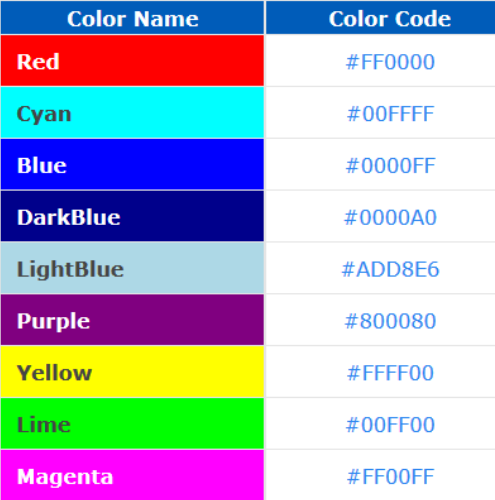
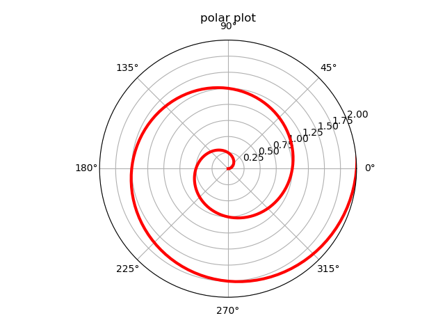
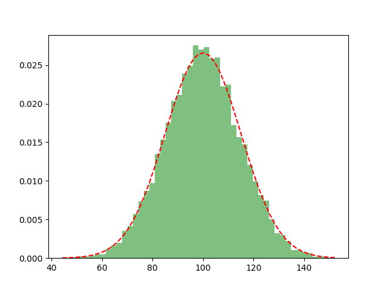
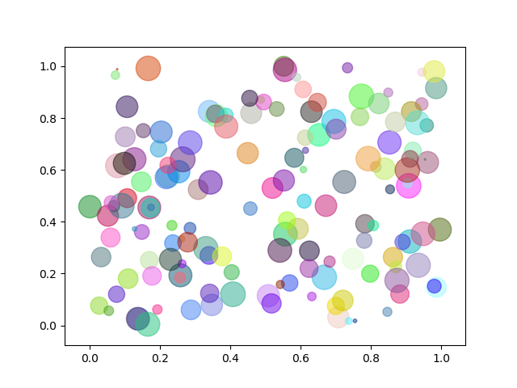
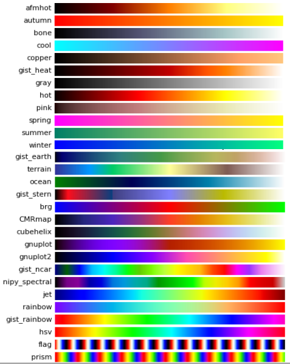
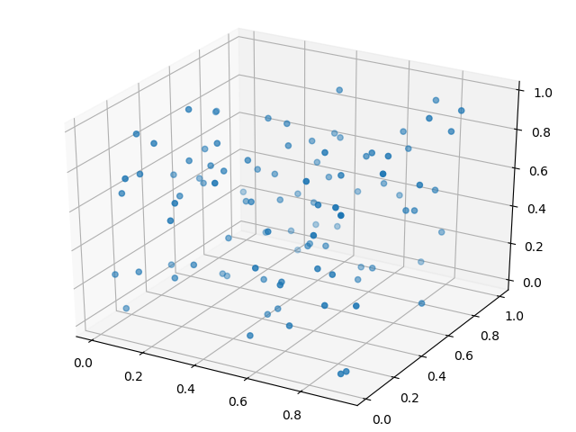
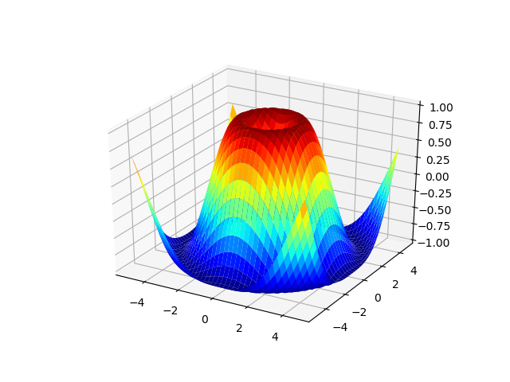
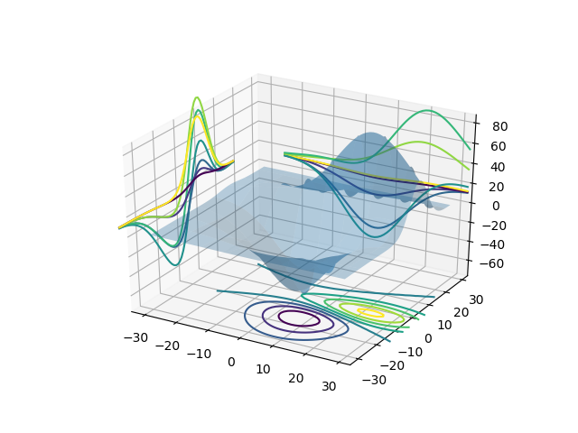
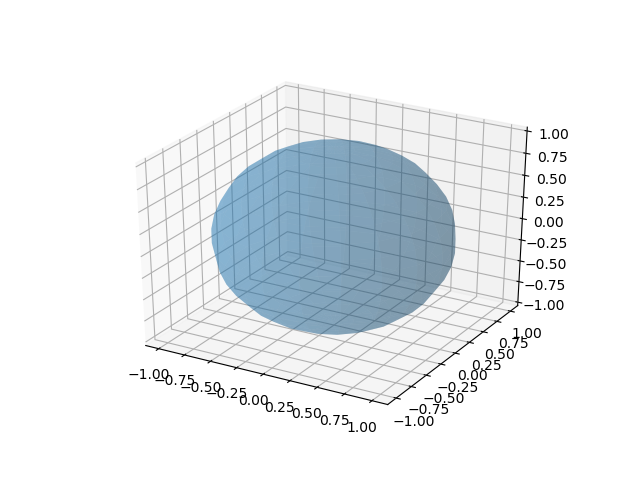

# 13 扩展：绘图模块 matplotlib

## 图形相关模块

Matplotlib：基于数值计算模块Numeric及Numarray，克隆了许多Matlab中的函数，帮助用户轻松地获得高质量的二维图形。 PIL\(Python Imaging Library\)：支持各种图片文件格式，能进行图形格式的转换、显示，以及图形的放大、缩小和旋转等处理。 Visual：是Python的一个简单易用的3D图形库，使用它可以快速创建3D场景、动画。

下面我们来通过实际的例子来学习matplotlib绘图模块。

范例：绘制函数

```python
import numpy as np
import matplotlib.pyplot as plt

x = np.linspace(0, 10, 1000)
y = np.sin(x) ; z = np.cos(x**2)
plt.figure()
plt.plot(x,y,label="$sin(x)$",color="red",linewidth=2)
plt.plot(x,z,"b--",label="$cos(x^2)$")
plt.legend(loc=3)
plt.show() #保存图像可用 plt.savefig('fig.jpg')
plt.close()
```

程序运行结果如下：


### Plot参数

```python
• alpha : float
• color or c : any matplotlib color
• label : any string , 图注名称
• linestyle or ls : [ '-' | '--' | '-.' | ':' | 'steps' | ...]
• linewidth or lw: float value (points, 0.3527mm )
• marker [ '+' | ',' | '.' | '1' | '2' | '3' | '4' ]
• markersize or ms : float
• zorder: any number 叠放顺序
```

### 颜色



```python
• 蓝色： 'b' (blue)
• 绿色： 'g' (green)
• 红色： 'r' (red)
• 青色： 'c' (cyan)
• 洋红： 'm' (magenta)
• 黄色： 'y' (yellow)
• 黑色： 'k' (black)
• 白色： 'w' (white)

• 灰度表示： e.g. 0.75 ([0,1]内任意浮点数)
• RGB表示法： 由红色、绿色和蓝色的值组成的十六进制符号来定义 e.g. '#2F4F4F' 或 (0.18,0.31,0.31)
```

### 坐标轴定制

```python
• plt.title('sine function demo')
• plt.xlabel('time(s)')
• plt.ylabel('votage(mV)')
• plt.xlim([0.0,5.0])
• plt.ylim([-1.2,1.2])
• plt.hold('on') # 保持之前plot的结果
• plt.grid('on') # 添加网格
• plt.text(4,0,'$\mu=100$') # 文本
• plt.axis('equal') # 等比例坐标轴
• plt.ylim(plt.ylim()[::-1]) # 翻转Y轴
• plt.gca().invert_yaxis() # 翻转Y轴
```

### 极坐标

```python
import numpy as np
import matplotlib.pyplot as plt

r = np.arange(0, 3.0, 0.01)
theta = 2 * np.pi * r
ax = plt.subplot(111, polar=True)
ax.plot(theta, r, color='r', linewidth=3)
ax.set_rmax(2.0)
ax.grid(True)
ax.set_title("polar plot")
plt.show()
```

程序运行结果如下：



### 图表类型

matplotlib模块支持的图表类型非常之多，几乎能胜任任何绘图任务。但对于特定数据，选取合适的图表类型来表达数据的内涵非常重要。为了方便科学计算和数据分析的初学者，我们这里给出一个简单的示意图来告诉大家如何选取合适的图表类型。


### 直方图

```python
import numpy as np
import matplotlib.mlab as mlab
import matplotlib.pyplot as plt

mu = 100 # mean of distribution
sigma = 15 # standard deviation of distribution
x = mu + sigma * np.random.randn(10000)
num_bins = 50
# the histogram of the data
n, bins, patches = plt.hist(x, num_bins, normed=1,
facecolor='green', alpha=0.5)
y = mlab.normpdf(bins, mu, sigma) # add a 'best fit' line
plt.plot(bins, y, 'r--')
plt.show()
```

程序运行结果如下：



### 散点图

```python
import matplotlib.pyplot as plt
import numpy as np

n = 150
x = np.random.rand(n,3)
c = np.random.rand(n,3)
plt.scatter(x[:,0], x[:,1], s=x[:,2]*500, alpha=0.5, color=c)
plt.show()
```

程序运行结果如下：



### 柱状图

```python
from matplotlib.ticker import FuncFormatter
import matplotlib.pyplot as plt
import numpy as np

x = np.arange(4)
money = [1.5e5, 2.5e6, 5.5e6, 2.0e7]

def millions(x, pos):
    'The two args are the value and tick position'
    return '$%1.1fM' % (x * 1e-6)

formatter = FuncFormatter(millions)

fig, ax = plt.subplots()
ax.yaxis.set_major_formatter(formatter)
plt.bar(x, money)
plt.xticks(x, ('Bill', 'Fred', 'Mary', 'Sue'))
plt.show()
```

程序运行结果如下：


### 多子图

```python
• subplot(numRows, numCols, plotNum)
– plt.subplot(221) # 第一行的左图
– plt.subplot(222) # 第一行的右图
– plt.subplot(212) # 第二整行
– plt.show()
– ax1 = plt.subplot(211) # 创建子图1
– ax1.plot(x,y)
– ax2 = plt.subplot(212) # 创建子图2
– ax2.plot(x,y)
```

### colormap



```python
• 查看可用色表
import pylab as pl
pl.colormaps()
• 查看色表内容
pl.cm.hot(0.001)
pl.cm.hot(0.999)
pl.cm.hot(0.5)
pl.cm.hot(0.5, 0.5)
```

### 三维作图

```python
from matplotlib import pyplot as plt
from mpl_toolkits.mplot3d import Axes3D
import numpy as np

fig = plt.figure()
ax = Axes3D(fig)
data = np.random.random([100,3])
np.random.shuffle(data)
ax.scatter(data[:,0],data[:,1],data[:,2], marker='o')
plt.show()
```

程序运行结果如下：



### 三维曲面

```python
from mpl_toolkits.mplot3d import Axes3D
import matplotlib.pyplot as plt
import numpy as np

cmap = plt.cm.jet
fig = plt.figure()
ax = fig.gca(projection='3d')
X = np.arange(-5, 5, 0.25)
Y = np.arange(-5, 5, 0.25)
X, Y = np.meshgrid(X, Y)
Z = np.sin(np.sqrt(X**2 + Y**2))
ax.plot_surface(X, Y, Z, rstride=1, cstride=1, cmap=cmap )
ax.set_zlim(-1.01, 1.01)
plt.show()
```

程序运行结果如下：



### 等高线图

```python
import matplotlib.pyplot as plt
import numpy as np

plt.figure()
X = np.arange(-5, 5, 0.25)
Y = np.arange(-5, 5, 0.25)
X, Y = np.meshgrid(X, Y)
Z = np.sin(np.sqrt(X**2 + Y**2))
levels = np.arange(-1,1,0.25)
cs = plt.contour(X, Y, Z, levels)
plt.clabel(cs,inline=1,fontsize=8)
plt.axis('equal')
plt.show()
```

程序运行结果如下：


### 三维投影

```python
from mpl_toolkits.mplot3d import axes3d
import matplotlib.pyplot as plt
from matplotlib import cm

fig = plt.figure()
ax = fig.gca(projection='3d')
X, Y, Z = axes3d.get_test_data(0.1)
ax.plot_surface(X, Y, Z, rstride=8,cstride=8, alpha=0.3)
cset = ax.contour(X, Y, Z, zdir='z', offset=-100)
cset = ax.contour(X, Y, Z, zdir='x', offset=-40)
cset = ax.contour(X, Y, Z, zdir='y', offset=40)
plt.show()
```

程序运行结果如下：



### mplot3d 函数

```python
• plot3D：三维控件绘图
• plot_surface： 三维网格曲面
• plot_trisurf： 三维三角曲面
• plot_wireframe：三维线图
• quiver： 矢量图
• quiver3D： 三维矢量图
• scatter: 散点图
```

### 三维球面

方法一：

```python
from mpl_toolkits.mplot3d import Axes3D
import matplotlib.pyplot as plt
import numpy as np

fig = plt.figure()
ax = fig.add_subplot(111, projection='3d')
u = np.linspace(0, 2 * np.pi, 100)
v = np.linspace(0, np.pi, 100)
x = 10 * np.outer(np.cos(u), np.sin(v))
y = 10 * np.outer(np.sin(u), np.sin(v))
z = 10 * np.outer(np.ones(np.size(u)), np.cos(v))
ax.plot_surface(x, y, z, rstride=4, cstride=4, color='b')
plt.show()
```

程序运行结果如下：


方法二：

```python
from mpl_toolkits.mplot3d import Axes3D
import matplotlib.pyplot as plt
import numpy as np

fig = plt.figure()
ax = fig.gca(projection='3d')
u, v = np.ogrid[0:2*np.pi:20j, 0:np.pi:20j]
x=np.cos(u)*np.sin(v)
y=np.sin(u)*np.sin(v)
z=np.cos(v)
ax.plot_surface(x, y, z, rstride=1, cstride=1, alpha=0.3)
plt.show()
```

程序运行结果如下：



## pylab实时动画

```python
import pylab as pl
import numpy as np

pl.ion() #实时绘图
pl.show()
x = np.arange(0,2*np.pi,0.01)
line, = pl.plot(x,np.sin(x))
for i in np.arange(1,200):
    line.set_ydata(np.sin(x+i/10.0))
    pl.pause(0.05)
pl.ioff() #关闭实时绘图
```

程序运行结果如下：


### 动画模块 animation

```python
import numpy as np
import matplotlib.pyplot as plt
import matplotlib.animation as ani

fig = plt.figure()
x = np.arange(0, 2*np.pi, 0.01) # x-array
line, = plt.plot(x, np.sin(x))
def animate(i):
    line.set_ydata(np.sin(x+i/10.0)) # update the data
    return line
ani.FuncAnimation(fig, animate, np.arange(1, 200), interval=25, blit=True)
plt.show()
```

